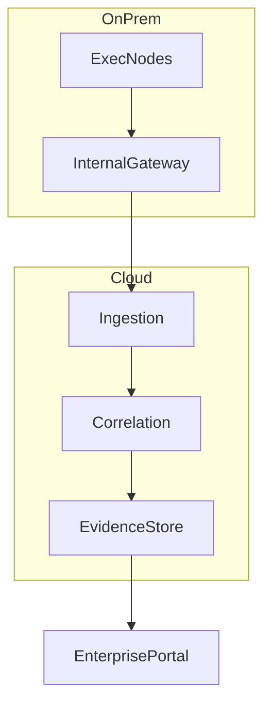

# Deployment Patterns

## Air-Gapped

For high assurance environments where outbound connectivity is constrained and evidence export is controlled through approved transfer gateways.

## Hybrid Cloud

Execution stays near workload domains while validation and analytics run in managed cloud segments.

## SaaS

Managed Nexus control and validation layers with tenant-isolated logical boundaries.

## On-Prem Enterprise

Full deployment inside enterprise-controlled infrastructure with internal PKI and policy governance.

## Kubernetes

Containerized Nexus components with namespace isolation, service identity, and policy admission controls.

