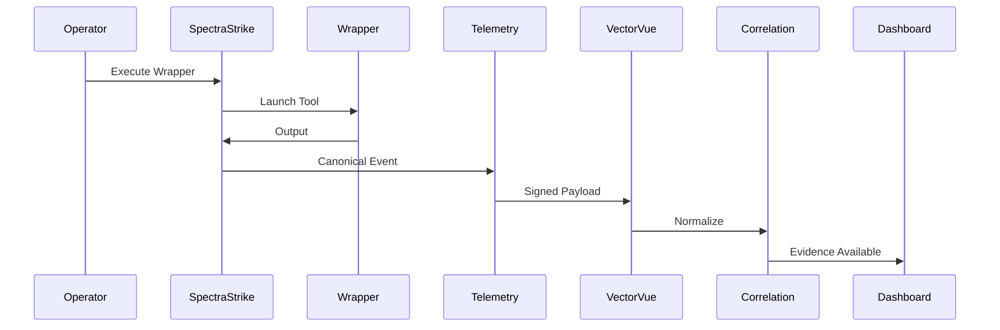

# Execution to Telemetry Flow

1. Wrapper invocation: SpectraStrike launches a policy-approved wrapper with deterministic runtime metadata.
2. `execution_fingerprint`: generated from normalized execution intent and context.
3. `attestation_hash`: computed from wrapper identity, execution constraints, and output provenance fields.
4. Ed25519 signing: canonical telemetry payload is signed before transmission.
5. Emission pipeline: signed payload enters outbound gateway with replay and integrity protections.
6. Ingestion: VectorVue verifies signature, schema, and fingerprint continuity.
7. Correlation: validated telemetry is linked to assurance entities and surfaced as evidence.

