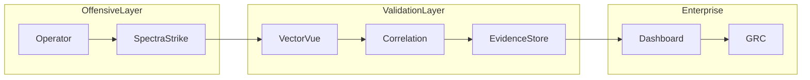

# Nexus Architecture

## High-Level Explanation

Nyxera Nexus coordinates execution control and evidence validation as a single architecture composed of an offensive execution layer, a validation layer, and enterprise consumption services.

## Logical Architecture

- Execution domain: operator intent, policy evaluation, wrapper invocation, telemetry generation
- Validation domain: payload verification, normalization, enrichment, correlation, evidence indexing
- Consumption domain: dashboards, APIs, compliance exports, GRC connectors

## Physical Architecture

- Edge execution nodes for SpectraStrike workloads
- Ingestion and correlation clusters for VectorVue
- Segmented storage tiers for hot evidence, audit archives, and governance exports

## Control Plane vs Data Plane

- Control plane: policy distribution, configuration signing, identity/authorization, tenant governance
- Data plane: wrapper output, signed telemetry payloads, evidence correlation records

## Trust Boundaries

- Operator boundary: authenticated execution requests only
- Wrapper boundary: signed wrapper manifests and runtime integrity checks
- Telemetry boundary: signed payload verification and replay resistance
- Tenant boundary: strict namespace and storage segregation

