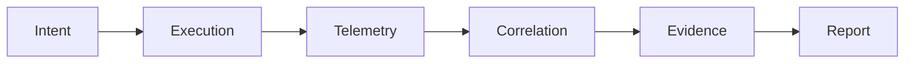

# Data Model

Nexus data model includes:

- Execution intent entities
- Wrapper execution artifacts
- Signed telemetry events
- Correlation objects and assurance verdicts
- Evidence lifecycle metadata

