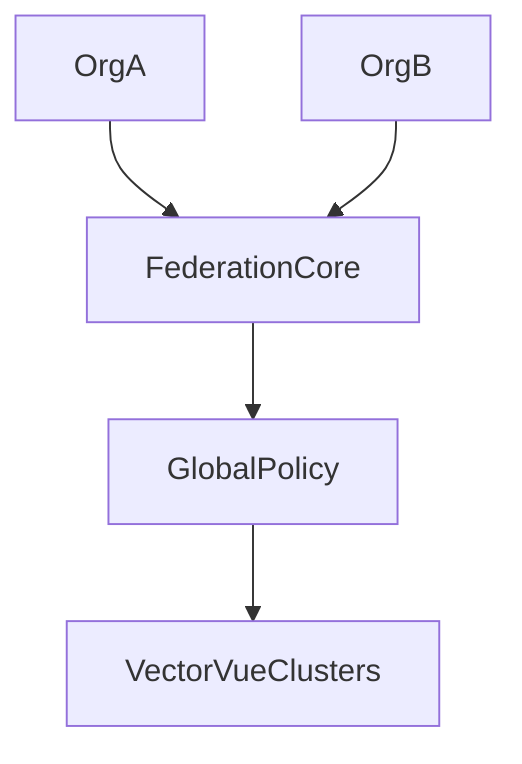

# Federation Model

Nexus federation supports enterprise-scale evidence exchange without collapsing tenant isolation.

## Core Principles

- Multi-tenant federation with organization-scoped trust domains
- Org isolation for execution, telemetry, and evidence paths
- Evidence segregation with tenant-specific storage and encryption context
- Global policy orchestration with local enforcement boundaries

